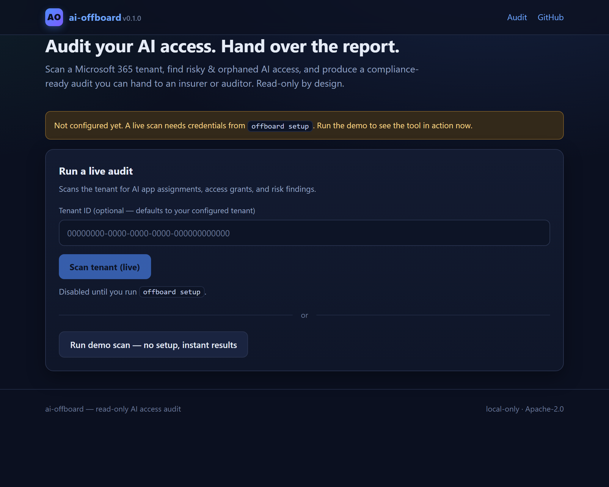
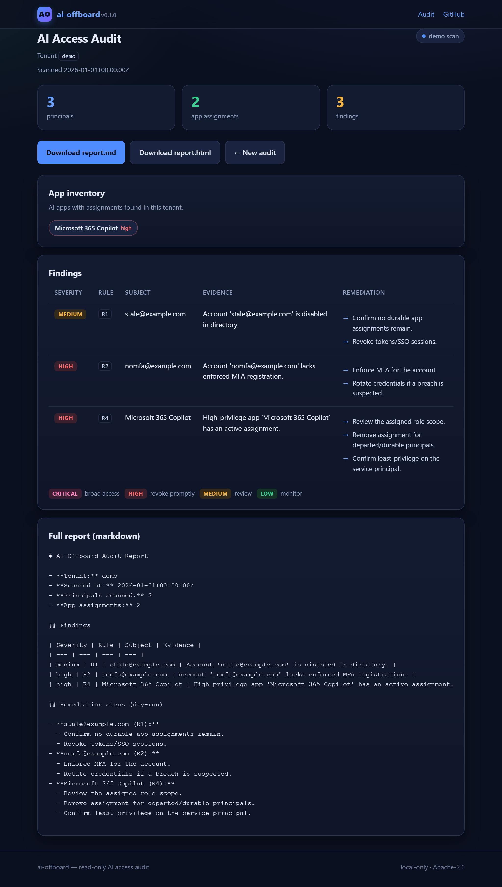

# AI-Offboard

**The AI tool audit + offboarding report you hand your insurance agent.**

SMBs and MSPs have a loud, unfilled problem: no one can catalog the AI tools
running in a tenant, see what data they touch, or prove on departure that
access was revoked. Enterprise DLP vendors chase the big-org blocking market
and skip the small-org audit-and-revoke-at-departure moment. `ai-offboard`
closes that gap with a **read-only** scanner that produces the compliance
artifact an insurer, SOC2, or renewal actually accepts.

> **Read-only by design.** v1 makes zero writes: it never disables an account,
> never revokes a token, never changes anything. It audits and reports. The
> plan it produces is a dry-run checklist for a human to approve.

## What it does

- Enumerates users, app assignments, and service-principal grants in a
  Microsoft 365 tenant
- Maps them to an AI-app catalog with **DLP-risk tiers** (high/medium/low)
- Flags risky access: stale access on departure, MFA gaps, unused high-tier
  seats, broad high-privilege grants
- Emits a **dry-run revocation plan** (execute nothing)
- Renders a plain-English **audit report** (.md + .html) an auditor can read

## Quick start

### Install

```bash
pip install "ai-offboard[web]"     # from PyPI
# or from source: pip install -e ".[web]"
```

### Try the demo now (no Azure required)

```bash
offboard web                 # local web UI, then click "Run demo scan"
offboard audit --tenant demo --mock  # or a terminal report
```

### Connect your tenant (interactive, recommended)

One command — no App Registration, no tenant ID, no client secret. Sign in as a
Global Administrator via Microsoft's device code flow; the tenant ID is
automatically detected from the token:

```bash
offboard auth login         # copy the code → microsoft.com/devicelogin → done
offboard audit              # scan your tenant
```

On subsequent runs the cached token is reused silently.

### Connect your tenant (CI / service account)

For automation, still supports client credentials via an Azure App Registration:

```bash
offboard setup                          # guides through App Registration + writes .env
offboard audit --tenant <id>            # scan to terminal
offboard audit --tenant <id> --report   # write report.md + report.html
offboard plan --user <upn>              # dry-run revocation steps (executes nothing)
```

## Zero Trust policy engine (v3)

Turn the inventory into enforceable policy. Policies are declarative YAML
using **named checks only** (no arbitrary expressions, so opening a policy
file never executes code). The bundled baseline ships five policies:

```bash
offboard policy list            # see checks + bundled policies
offboard policy check           # scan tenant, evaluate policy, exit 0 on PASS / 2 on FAIL
offboard policy check --json    # machine-readable compliance report
```

Bundled policies:
- **ZT-001** No stale or orphaned access
- **ZT-002** MFA enforced on all principals
- **ZT-003** No high-privilege AI app assignments
- **ZT-004** No broad OAuth grants
- **ZT-005** Approved AI-app allowlist (default-deny Zero Trust)

Bring your own policies: drop a `.yml` file into `offboard/policies/default/`
(or pass a path to the loader) with the same `policies:` structure.

## Power features

### Execute remediation (v2 — writes to the tenant)

`offboard execute` turns the audit findings into real actions, behind an
explicit approval gate. Every mutation is appended to the local audit log:

```bash
offboard plan --tenant <id>       # review what will change (read-only)
offboard execute --tenant <id>    # approve each step, then it applies:
                                  #   block sign-in, revoke tokens, remove app assignment
```

Use `--yes` to skip the interactive confirmation (CI/automation), and
`--target <upn-or-app>` to limit execution to one subject.

### Scheduled recurring audits

```bash
offboard schedule add <tenant-id> --interval weekly   # daily | weekly | monthly
offboard schedule list
offboard schedule run-due         # drive from cron / Task Scheduler (offboard schedule run-due)
```

Reports are written to `reports/` and emailed when SMTP is configured
(`OFFBOARD_SMTP_HOST`, `OFFBOARD_SMTP_PORT`, `OFFBOARD_SMTP_USER/PASS`,
`OFFBOARD_MAIL_FROM`, `OFFBOARD_MAIL_TO`).

### Multi-tenant (MSP mode)

```bash
offboard tenant add <tenant-id> --name "Acme Corp"
offboard tenant list
offboard audit --all              # sweep every registered tenant into a matrix
```

### Trend comparison

```bash
offboard audit --tenant <id>      # scan + auto-save (twice for a trend)
offboard report --compare         # diff the last two scans: new vs resolved findings
offboard report --last            # re-render the last saved scan
```

### Exports

```bash
offboard audit --json             # findings as JSON to stdout
offboard audit --csv              # findings to ai-offboard-findings.csv (MSP tooling friendly)
offboard audit --report           # markdown + html report files
```

### Google Workspace

```bash
export GOOGLE_SERVICE_ACCOUNT_JSON=/path/to/service-account.json
export OFFBOARD_GOOGLE_ADMIN="admin@yourdomain.com"
offboard audit --workspace       # reads users + their OAuth-connected AI apps
```

The Workspace connector maps each user's granted third-party apps (ChatGPT,
Fireflies, Zapier, …) into the same risk rules as the Entra connector.

## Screenshots

**Landing page** — run a live scan or a one-click demo (no Azure required):



**Audit report** — stat cards, AI app inventory with DLP-risk tiers,
per-finding remediation steps, and `.md` / `.html` downloads:



Reproduce with `offboard web` then `python scripts/capture_screenshots.py`.

## Sample output

Run `offboard audit --tenant demo --mock` (or the web UI) to see a live report.
A representative report renders like this:

```markdown
# AI-Offboard Audit Report

- **Tenant:** demo
- **Principals scanned:** 3
- **App assignments:** 2

| Severity | Rule | Subject | Evidence |
| --- | --- | --- | --- |
| medium | R1 | stale@example.com | Account is disabled in directory. |
| high   | R2 | nomfa@example.com | Account lacks enforced MFA registration. |
| high   | R4 | Microsoft 365 Copilot | High-privilege app has an active assignment. |
```

## v1 scope

- **Two auth modes**: interactive device-code login (`offboard auth login`, no
  tenant ID needed) or client credentials (CI/service accounts via App Registration).
- **Read-only** Microsoft Entra ID connector (Graph, GET-only)
- AI-app catalog (`apps.json`) with DLP-risk tiers
- Risk rules → findings (stale access, MFA gaps, unused high-tier seats, broad grants)
- Dry-run revocation plan + audit report (MD + HTML)
- Local web UI (`offboard web`) with "Connect Microsoft 365" flow
- Mock/demo mode (`--mock`) so anyone can evaluate with zero creds

**Not in v1:** write/execute revocation, Google Workspace connector, DB,
multi-tenant SaaS. See [SPEC.md](SPEC.md) for the roadmap.

## Install

```bash
# Core CLI (no web UI)
pipx install .                        # or: pip install -e .

# With the local web UI
pip install -e ".[web]"
```

Requires Python 3.11+. The wheel ships the app catalog and web templates, so
a normal `pip install` is whole (4 data files verified in the built wheel).

## Contributing

The fastest way in is a one-PR `apps.json` catalog entry. See
[CONTRIBUTING.md](CONTRIBUTING.md).

## Security

Read-only by design; v1 makes zero mutating Graph calls. See
[SECURITY.md](SECURITY.md).

## License

Apache-2.0. See [LICENSE](LICENSE).